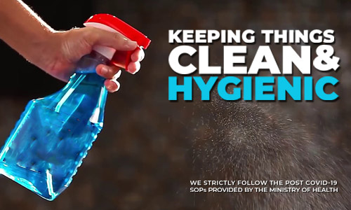
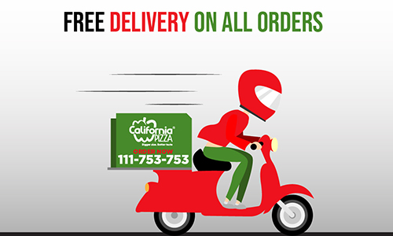

<!DOCTYPE html PUBLIC "-//W3C//DTD XHTML 1.0 Transitional//EN" "http://www.w3.org/TR/xhtml1/DTD/xhtml1-transitional.dtd">
<html xmlns="http://www.w3.org/1999/xhtml" lang="en">

<head>
<meta http-equiv="Content-Type" content="text/html; charset=utf-8" />
    <!-- Required meta tags -->
    <meta charset="utf-8">
    <meta name="viewport" content="width=device-width, initial-scale=1">
    
<!-- Bootstrap CSS -->
<link rel="stylesheet" href="https://stackpath.bootstrapcdn.com/bootstrap/4.5.0/css/bootstrap.min.css" integrity="sha384-9aIt2nRpC12Uk9gS9baDl411NQApFmC26EwAOH8WgZl5MYYxFfc+NcPb1dKGj7Sk" crossorigin="anonymous">
<link rel="stylesheet" href="https://stackpath.bootstrapcdn.com/bootstrap/4.5.0/css/bootstrap.min.css" integrity="sha384-9aIt2nRpC12Uk9gS9baDl411NQApFmC26EwAOH8WgZl5MYYxFfc+NcPb1dKGj7Sk" crossorigin="anonymous">
<link rel="stylesheet" href="https://stackpath.bootstrapcdn.com/bootstrap/5.0.0-alpha1/css/bootstrap.min.css" integrity="sha384-r4NyP46KrjDleawBgD5tp8Y7UzmLA05oM1iAEQ17CSuDqnUK2+k9luXQOfXJCJ4I" crossorigin="anonymous">
<link href="css/bootstrap.css" rel="stylesheet"  type="text/css" />
<link href="my css.css" rel="stylesheet" type="text/css" />
<link rel="apple-touch-icon" sizes="180x180" href="/apple-touch-icon.png">
<link rel="icon" type="image/png" sizes="32x32" href="/favicon-32x32.png">
<link rel="icon" type="image/png" sizes="16x16" href="/favicon-16x16.png">
<link rel="shortcut icon" href="/favicon-32x32.png" type="image/x-icon">

<link rel="manifest" href="/site.webmanifest">
<link rel="stylesheet" href="https://unpkg.com/aos@next/dist/aos.css" />
<title> Pizza</title>

</head>

<body>

<!-- Bootstrap navbar start -->
<nav class="navbar navbar-expand-lg navbar-dark bg-danger fixed-top">
  

  
    <button class="navbar-toggler" type="button" data-toggle="collapse" data-target="#navbarTogglerDemo01" aria-controls="navbarTogglerDemo01" aria-expanded="true" aria-label="Toggle navigation">
      
    </button>
    
    

      <a class="navbar-brand" href="index.html">Pizza Red</a>
      <ul class="navbar-nav mr-auto mb-2 mb-lg-0">
        <li class="nav-item">
          <a class="nav-link active" aria-current="page" href="index.html">Home</a>
        </li>
        <li class="nav-item">
          <a class="nav-link active " href="Products.html">Products</a>
        </li>
       
        <li class="nav-item">
          <a class="nav-link  active"  href="About Us.html">About Us</a>
        </li>
      
      <li class="nav-item">
          <a class="nav-link  active" href="Contact Us.html">Contact Us</a>
        </li>
      </ul>
    
    

  

</nav>
<!-- Bootstrap navbar End -->

<!-- Bootstrap Slide start -->

  

    

      
    

    

      
    

    

      
    

  

  <a class="carousel-control-prev" href="#carouselExampleFade" role="button" data-slide="prev">
    
    Previous
  </a>
  <a class="carousel-control-next" href="#carouselExampleFade" role="button" data-slide="next">
    
    Next
  </a>

<!-- Bootstrap Slide end -->

 <!-- Handing Gallary Start --> 

<h1 class="font-weight-light font1 display-4 shadow p-3 mb-2 bg-danger rounded">Red Pizza Info</h1>

 <!-- Handing Gallary End --> 

 <!--Map card start-->
 

  

    

      

       
      <iframe src="https://www.google.com/maps/embed?pb=!1m18!1m12!1m3!1d1808.362227518501!2d67.06525827844109!3d24.97548785211611!2m3!1f0!2f0!3f0!3m2!1i1024!2i768!4f13.1!3m3!1m2!1s0x3eb340e91847a9db%3A0x89ef081ceca2f320!2sPizza%20Bite!5e0!3m2!1sen!2s!4v1595218319409!5m2!1sen!2s" width="100%" height="450" frameborder="0" style="border:10px;" allowfullscreen="" aria-hidden="false" tabindex="">Pizza</iframe>
    
  
    

    

      

        <h5 class="card-header">Google Map</h5>
          
You Can Easily Arrive with The Help of Google Map

    
      

    

  

<!--Map card end-->
 
 <!-- Gallary Image Start -->

  

  

<!-- Gallary Image end -->

<!-- Bootstrap footer start -->

<!-- Footer -->
<footer style="background-color: rgba(149, 107, 113, 0.404);" class="page-footer font-small">

  

    

      <!-- Grid row-->
      

        <!-- Grid column -->
        

          <h6 class="mb-0">Get connected with us on social networks!</h6>
        

        <!-- Grid column -->

        <!-- Grid column -->
        

          <!-- Facebook -->
          <a class="fb-ic">
            <i class="fab fa-facebook-f white-text mr-4"> </i>
          </a>
          <!-- Twitter -->
          <a class="tw-ic">
            <i class="fab fa-twitter white-text mr-4"> </i>
          </a>
          <!-- Google +-->
          <a class="gplus-ic">
            <i class="fab fa-google-plus-g white-text mr-4"> </i>
          </a>
          <!--Linkedin -->
          <a class="li-ic">
            <i class="fab fa-linkedin-in white-text mr-4"> </i>
          </a>
          <!--Instagram-->
          <a class="ins-ic">
            <i class="fab fa-instagram white-text"> </i>
          </a>

        

        <!-- Grid column -->

      

      <!-- Grid row-->

    

  

  <!-- Footer Links -->
  

    <!-- Grid row -->
    

      <!-- Grid column -->
      

        <!-- Content -->
        <h6 class="text-uppercase font-weight-bold">Red Pizza</h6>
        

        
It certainly is a matter of pride that, despite so many odds, we at Pizza point continue to present the positive image of Pakistan by setting novel example of rapid growth of food business..

      

      <!-- Grid column -->

      <!-- Grid column -->
      

        <!-- Links -->
        <h6 class="text-uppercase font-weight-bold">Products</h6>
        

        

         <a href="#!">Facebook</a>
        

        

          <a href="#!">Instagram</a>
        

        

          <a href="#!">Whatsapp</a>
        

        

          <a href="#!">Youtube</a>
        

      

      <!-- Grid column -->

      <!-- Grid column -->
      

        <!-- Links -->
        <h6 class="text-uppercase font-weight-bold">Useful links</h6>
        

        

          <a href="#!">Your Account</a>
        

        

          <a href="#!">Become an Affiliate</a>
        

        

          <a href="About Us.html">Shipping Rates</a>
        

        

          <a href="Contact Us.html">Help</a>
        

      

      <!-- Grid column -->

      <!-- Grid column -->
      

        <!-- Links -->
        <h6 class="text-uppercase font-weight-bold">Contact</h6>
        

        

          <i class="fas fa-home mr-3"></i>Pakistan, pk 10012, pk

        

          <i class="fas fa-envelope mr-3"></i> info@redpizza.com

        

          <i class="fas fa-phone mr-3"></i> + 01 234 567 88

        

          <i class="fas fa-print mr-3"></i> + 01 234 567 89

      

      <!-- Grid column -->

    

    <!-- Grid row -->

  

  <!-- Footer Links -->

  <!-- Copyright -->
  
© 2020 Copyright:
    <a href="#">redpizza</a>
  

  <!-- Copyright -->

</footer>
<!-- Footer -->

<!-- Bootstrap footer End -->
<!-- Bootstrap footer start -->
<footer class=" alert-dark text-center">CopyRight 2020-6-27 Pizza Red, Pakistan Inc. All rights reserved.</footer>

<!-- Bootstrap footer end -->

</body>
</html>

